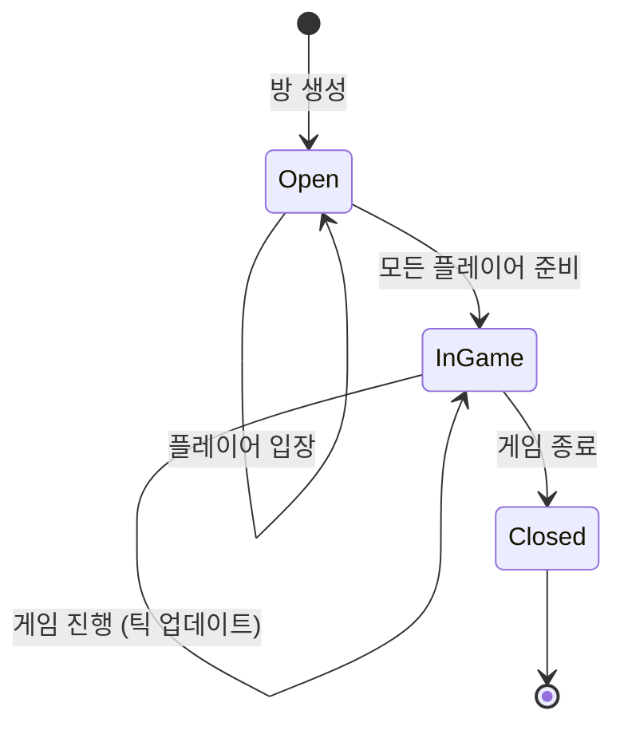

# BaseServer 유저 플로우 분석

클라이언트(플레이어)가 서버에 접속하여 게임을 시작하고 첫 10틱까지 진행되는 전체 플로우를 다이어그램으로 표현합니다.

## 전체 플로우 다이어그램

```mermaid
sequenceDiagram
    participant C as Client
    participant S as Server (Program.cs)
    participant CS as ClientSession
    participant PH as ProtocolHandler
    participant DB as DBManager
    participant RM as RoomManager
    participant GR as GameRoom
    participant GRU as GameRoomUser
    participant G as Game Instance
    participant GP as GamePlayer

    Note over S: 서버 시작
    S->>S: TcpListener.Start()
    S->>S: AcceptTcpClientAsync() 대기

    Note over C,CS: 1. 클라이언트 접속
    C->>S: TCP 연결 요청
    S->>CS: new ClientSession(client)
    CS->>CS: SessionId 생성
    CS->>PH: ProtocolHandler 초기화
    CS->>CS: RegisterProtocolHandlers()
    CS->>CS: StartAsync()
    CS->>CS: StartTimeoutCheck()
    CS->>CS: ReceiveLoop() 시작

    Note over C,DB: 2. 회원가입 (선택적)
    C->>CS: REQUEST_REGISTER
    CS->>PH: HandleProtocol()
    PH->>CS: Handle_RequestRegister()
    CS->>DB: RegisterUser(username, password)
    DB-->>CS: 회원가입 성공
    CS-->>C: RESPONSE (SUCCESS)

    Note over C,DB: 3. 로그인
    C->>CS: REQUEST_LOGIN
    CS->>PH: HandleProtocol()
    PH->>CS: Handle_RequestLogin()
    CS->>DB: AuthenticateUser(username, password)
    DB-->>CS: UserInfo 반환
    CS->>CS: m_userInfo 설정
    CS-->>C: RESPONSE (SUCCESS, sessionId)

    Note over C,RM: 4. 로비 입장
    C->>CS: REQUEST_JOIN_LOBBY
    CS->>PH: HandleProtocol()
    PH->>CS: Handle_RequestJoinLobby()
    CS->>RM: GetRoomList(page)
    RM-->>CS: RoomInfo[]
    CS-->>C: RESPONSE (roomCount, roomList)

    Note over C,GR: 5. 방 생성
    C->>CS: REQUEST_CREATE_ROOM
    CS->>PH: HandleProtocol()
    PH->>CS: Handle_RequestCreateRoom()
    CS->>RM: CreateRoom()
    RM->>GR: new GameRoom(roomId)
    GR->>G: new Game()
    GR->>GRU: new GameRoomUser() x2
    GR-->>RM: GameRoom 인스턴스
    RM-->>CS: GameRoom
    CS->>GR: UpdateRoomInfo(roomName, mapId)
    CS-->>C: RESPONSE (roomId, slot, roomList)

    Note over C,GR: 6. 방 입장
    C->>CS: REQUEST_JOIN_ROOM
    CS->>PH: HandleProtocol()
    PH->>CS: Handle_RequestJoinRoom()
    CS->>RM: GetRoom(roomId)
    RM-->>CS: GameRoom
    CS->>GR: TryAddPlayer(session, slot)
    GR->>GRU: Initialize(session)
    GRU->>GRU: RegistorProtos()
    GR->>CS: session.CurrentRoom = this
    GR->>GR: BroadcastUserJoined()
    CS-->>C: RESPONSE (roominfo, chatChannelId)

    Note over C,G: 7. 준비 완료
    C->>CS: REQUEST_READY
    CS->>PH: HandleProtocol()
    PH->>GRU: Handle_RequestReady()
    GRU->>GRU: m_IsReady = true
    GRU->>GR: OnChangedReady 이벤트
    GR->>GR: HandleOnReady()
    GRU-->>C: RESPONSE (SUCCESS)

    Note over GR,GP: 8. 게임 시작 (모든 플레이어 준비 완료)
    GR->>GR: 모든 플레이어 준비 확인
    GR->>G: UserJoin(session, commandSender)
    G->>GP: Initialize(session, commandSender)
    GP->>CS: RegisterProto(SUBMIT_COMMAND)
    Note right of GP: 인게임 커맨드 핸들러 등록
    GR->>G: StartGame(mapId)
    G->>G: MapManager.LoadMapData()
    G->>G: new GameMap(staticMapData)
    G->>G: m_gameState = RUNNING
    G->>G: m_tickCount = 0
    G->>G: Task.Run(GameLoop)

    Note over G: 9. 게임 루프 시작 (Tick 0)
    G->>G: UpdateGameState(deltaTime, 0)
    G->>G: MarkTickProcessed(0)
    G->>G: CommandProcess(0)
    G->>G: ResourceProduction(0)
    G->>G: ProductionProcess(0)
    G->>G: MovementProcess(0)
    G->>G: ConquerProcess(0)
    G->>G: BroadcastEvent(0)
    G->>GP: Async_SendGameState(state, 0)
    GP->>CS: SendAsync(GAME_STATE)
    CS-->>C: GAME_STATE (tick=0)
    G->>G: Task.Delay(50ms)

    Note over C,G: 10. Tick 1 (커맨드 예시)
    C->>CS: SUBMIT_COMMAND (ProduceFleet)
    CS->>PH: HandleProtocol()
    PH->>GP: HandleSubmitCommand()
    GP->>G: EnqueueCommand(ProduceFleet)
    Note right of G: 3틱 후 실행 예약 (Tick 4)
    
    G->>G: UpdateGameState(deltaTime, 1)
    G->>G: MarkTickProcessed(1)
    G->>G: CommandProcess(1)
    G->>G: ProductionProcess(1)
    G->>G: MovementProcess(1)
    G->>G: ConquerProcess(1)
    G->>G: BroadcastEvent(1)
    G->>GP: Async_SendGameState(state, 1)
    CS-->>C: GAME_STATE (tick=1)
    G->>G: Task.Delay(50ms)

    Note over G: 11. Tick 2
    G->>G: UpdateGameState(deltaTime, 2)
    G->>G: CommandProcess(2)
    G->>G: ProductionProcess(2)
    G->>G: MovementProcess(2)
    G->>G: BroadcastEvent(2)
    CS-->>C: GAME_STATE (tick=2)

    Note over G: 12. Tick 3
    G->>G: UpdateGameState(deltaTime, 3)
    G->>G: CommandProcess(3)
    G->>G: ProductionProcess(3)
    G->>G: MovementProcess(3)
    G->>G: BroadcastEvent(3)
    CS-->>C: GAME_STATE (tick=3)

    Note over G: 13. Tick 4 (명령 실행 & 자원 생산)
    G->>G: UpdateGameState(deltaTime, 4)
    G->>G: CommandProcess(4)
    Note right of G: Tick 1에 예약된 ProduceFleet 실행
    G->>G: ResourceProduction(4)
    Note over G: 4틱마다 자원 생산
    G->>G: ProductionProcess(4)
    G->>G: MovementProcess(4)
    G->>G: BroadcastEvent(4)
    CS-->>C: GAME_STATE (tick=4)

    Note over G: 14. Tick 5-9
    loop Tick 5 to 9
        G->>G: UpdateGameState(deltaTime, tick)
        G->>G: CommandProcess(tick)
        alt tick % 4 == 0
            G->>G: ResourceProduction(tick)
        end
        G->>G: ProductionProcess(tick)
        G->>G: MovementProcess(tick)
        G->>G: BroadcastEvent(tick)
        CS-->>C: GAME_STATE (tick)
        G->>G: Task.Delay(50ms)
    end

    Note over G: 15. Tick 10 (승리 조건 체크)
    G->>G: UpdateGameState(deltaTime, 10)
    G->>G: CommandProcess(10)
    G->>G: CheckWinCondition(10)
    Note over G: 10틱마다 승리 조건 체크
    G->>G: BroadcastEvent(10)
    CS-->>C: GAME_STATE (tick=10)
```



## 주요 프로토콜 타입

| 프로토콜 | 설명 | 파라미터 |
|---------|------|---------|
| `REQUEST_REGISTER` | 회원가입 요청 | username, password |
| `REQUEST_LOGIN` | 로그인 요청 | username, password |
| `REQUEST_JOIN_LOBBY` | 로비 입장 요청 | Page |
| `REQUEST_CREATE_ROOM` | 방 생성 요청 | roomName, mapId, isPrivate |
| `REQUEST_JOIN_ROOM` | 방 입장 요청 | userId, roomId, slot |
| `REQUEST_READY` | 준비 완료 | isReady |
| `SUBMIT_COMMAND` | 게임 명령 전송 | commandType, commandData |
| `GAME_STATE` | 게임 상태 브로드캐스트 | GameState 객체 |

## 게임 틱 시스템

### 틱 레이트
- **고정 틱 레이트**: 20 TPS (Ticks Per Second)
- **틱 간격**: 50ms (0.05초)

### 틱별 처리 내용

#### 매 틱마다 실행
1. **CommandProcess**: 플레이어 명령 처리 (명령은 현재 틱 + 3틱 후에 실행)
2. **ProductionProcess**: 함대 생산 진행도 업데이트
3. **MovementProcess**: 함대 이동 처리 및 전투 범위 체크
4. **ConquerProcess**: 행성 점령 진행도 업데이트
5. **BroadcastEvent**: 게임 상태를 모든 클라이언트에게 전송

#### 주기적 실행
- **ResourceProduction**: 4틱마다 (200ms) - 자원 생산
- **CheckWinCondition**: 10틱마다 (500ms) - 승리 조건 체크

## 명령 처리 메커니즘

### 명령 버퍼링
- 클라이언트가 보낸 명령은 즉시 실행되지 않음
- **버퍼 틱**: 현재 틱 + 3틱 후에 실행
- **목적**: 네트워크 지연 보상 및 결정론적 게임 시뮬레이션

### 명령 타입
1. **ProduceFleet**: 함대 생산 명령
2. **MoveFleet**: 함대 이동 명령

## 게임 상태 객체 구조

```typescript
GameState {
    state: int,           // 0=준비, 1=진행중, 2=종료
    players: Player[],    // 플레이어 배열
    planets: Planet[]     // 행성 배열
}

Player {
    id: int,
    fleets: FleetInfo[]
}

FleetInfo {
    position: Vector2,
    state: int,          // 0=Idle, 1=Battle, 2=Move
    HP: float,
    target: Vector2
}

Planet {
    owner: int,
    conquestProgress: float
}
```

## 세션 관리

### 타임아웃 시스템
- **타임아웃 시간**: 30초
- **체크 간격**: 5초마다
- **활동 갱신**: 메시지 수신/전송 시 자동 갱신

### 세션 라이프사이클
1. **생성**: TCP 연결 수락 시
2. **초기화**: SessionId 생성, ProtocolHandler 등록
3. **활성화**: ReceiveLoop 시작, TimeoutCheck 시작
4. **정리**: Disconnect → Cleanup → Room에서 제거

## 게임룸 상태 전이



## 핵심 클래스 역할

| 클래스 | 역할 |
|--------|------|
| **Program** | 서버 시작, TCP 리스너 관리 |
| **ClientSession** | 클라이언트 연결 관리, 프로토콜 수신/전송 |
| **ProtocolHandler** | 프로토콜 타입별 핸들러 매핑 및 실행 |
| **RoomManager** | 게임룸 생성/관리 (싱글톤) |
| **GameRoom** | 플레이어 관리, 게임 인스턴스 보유 |
| **GameRoomUser** | 룸 내 플레이어 상태 관리 (준비, 퇴장) |
| **Game** | 게임 로직 실행, 틱 시스템 관리 |
| **GamePlayer** | **인게임 플레이어 로직 (커맨드 처리, 상태 전송)** |

## 동기화 메커니즘

### Thread-Safe 처리
- **명령 큐**: `SemaphoreSlim`으로 동기화
- **게임룸**: `lock (m_lockObj)`로 플레이어 추가/제거 동기화
- **전송**: `lock (m_sendLock)`으로 네트워크 전송 동기화

### 비동기 처리
- 모든 프로토콜 핸들러는 `async Task` 패턴 사용
- 게임 루프는 별도 Task로 실행
- 브로드캐스트는 `Task.WhenAll`로 병렬 전송
